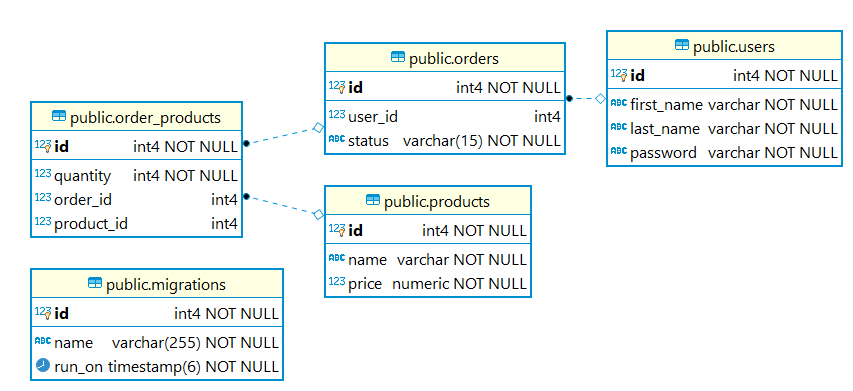

# API Requirements
The company stakeholders want to create an online storefront to showcase their great product ideas. Users need to be able to browse an index of all products, see the specifics of a single product, and add products to an order that they can view in a cart page. You have been tasked with building the API that will support this application, and your coworker is building the frontend.

These are the notes from a meeting with the frontend developer that describe what endpoints the API needs to supply, as well as data shapes the frontend and backend have agreed meet the requirements of the application. 

## API Endpoints
#### Products
- Index 
- Show
- Create [token required]

#### Users
- Index [token required]
- Show [token required]
- Create New User[token required]

#### Orders
- Current Order by user (args: user id)[token required]

## Data Shapes
-Shows the model objects shapes
#### Product
-  id
- name
- price

```
type Product = {
    id: number
    name: string,
    price: number
};
```

#### User
- id
- firstName
- lastName
- password

```
type User = {
    id ?: number,
    first_name: string,
    last_name: string,
    password: string
};
```

#### Orders
- id
- id of each product in the order
- quantity of each product in the order
- user_id
- status of order (active or complete)

```
type Order = {
    user_id: number,
    status: string
};
```

&nbsp;
&nbsp;

## DB Schemas
&nbsp;
### List of relations
 | Schema | Name           | Type  | Owner         |
|--------|----------------|-------|---------------|
| public | migrations     | table | shopping_user |
| public | order_products | table | shopping_user |
| public | orders         | table | shopping_user |
| public | products       | table | shopping_user |
| public | users          | table | shopping_user |

&nbsp;
&nbsp;

### Table "public.products"
 | Column |       Type        | Collation | Nullable |               Default |
|--------|----------------|-------|---------------|---------|
 id     | integer           |           | not null | nextval('products_id_seq'::regclass)
 name   | character varying |           | not null |
 price  | numeric           |           | not null |

#### Indexes:
    "products_pkey" PRIMARY KEY, btree (id)
#### Referenced by:
    TABLE "order_products" CONSTRAINT "order_products_product_id_fkey" FOREIGN KEY (product_id) REFERENCES products(id)

&nbsp;
&nbsp;

### Table "public.users"
   | Column |       Type        | Collation | Nullable |               Default |
|--------|----------------|-------|---------------|---------|
 id         | integer           |           | not null | nextval('users_id_seq'::regclass)
 first_name | character varying |           | not null |
 last_name  | character varying |           | not null |
 password   | character varying |           | not null |
#### Indexes:
    "users_pkey" PRIMARY KEY, btree (id)
#### Referenced by:
    TABLE "orders" CONSTRAINT "orders_user_id_fkey" FOREIGN KEY (user_id) REFERENCES users(id)

&nbsp;
&nbsp;

### Table "public.orders"
 | Column |       Type        | Collation | Nullable |               Default |
|--------|----------------|-------|---------------|---------|
 id      | integer               |           | not null | nextval('orders_id_seq'::regclass)
 user_id | integer               |           |          |
 status  | character varying(15) |           | not null |
#### Indexes:
    "orders_pkey" PRIMARY KEY, btree (id)
#### Check constraints:
    "orders_status_check" CHECK (status::text = 'active'::text OR status::text = 'completed'::text)
#### Foreign-key constraints:
    "orders_user_id_fkey" FOREIGN KEY (user_id) REFERENCES users(id)
#### Referenced by:
    TABLE "order_products" CONSTRAINT "order_products_order_id_fkey" FOREIGN KEY (order_id) REFERENCES orders(id)

&nbsp;
&nbsp;

### Table "public.order_products"
   | Column |       Type        | Collation | Nullable |               Default |
|--------|----------------|-------|---------------|---------|
 id         | integer |           | not null | nextval('order_products_id_seq'::regclass)
 quantity   | integer |           | not null |
 order_id   | integer |           |          |
 product_id | integer |           |          |
#### Indexes:
    "order_products_pkey" PRIMARY KEY, btree (id)
#### Check constraints:
    "order_products_quantity_check" CHECK (quantity > 0)
#### Foreign-key constraints:
    "order_products_order_id_fkey" FOREIGN KEY (order_id) REFERENCES orders(id)
    "order_products_product_id_fkey" FOREIGN KEY (product_id) REFERENCES products(id)

## DB relations diagram
****